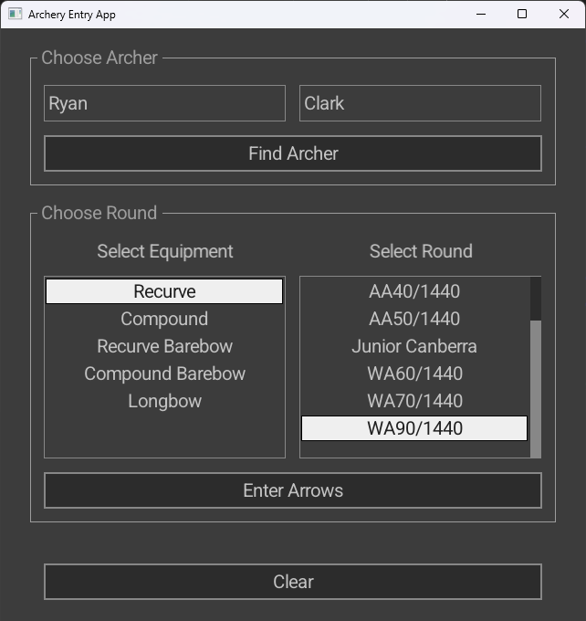
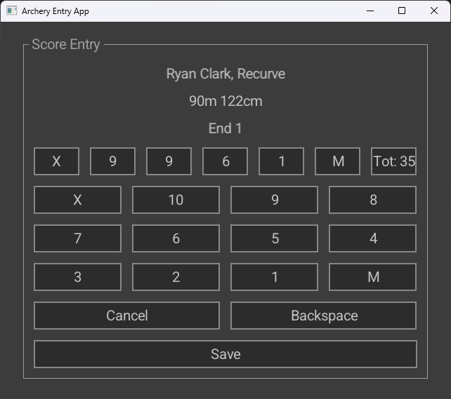

# Ewan Robson (103992579) Major Specific Work (Archery Score Recording)

The primary function of this application is to facilitate the entry of a single archery score through a desktop/mobile phone app, which serves as the most important use case for the system. The software provides a structured, graphical interface to log an archer's performance for specific rounds and records the data into the database.





## Building

**_IMPORTANT:_** Copy and paste libcrypto-3-x64.dll and libssl-3-x64.dll into build/RelWithDebInfo otherwise it WILL NOT RUN. It will just crash without any errors so make sure you do so.

If this still doesn't work, check the SQL servers version and match the static library accordingly.

**_Note: Only tested compiling on Windows using MSVC and LLVM/Clang. I have no idea if it compiles/runs on Linux/Mac_**

### Using MSVC

- Install [CMake](https://cmake.org/download/).
- Install [Visual Studio](https://visualstudio.microsoft.com/downloads/) with C++ workloads.
- Generate solution:
    - Open terminal in project root.
    - Run script `gen_msvc_project.bat`.
        - _Initial run fetches dependencies which may take some time._
        - Alternatively run `cmake -S . -B build -G "Visual Studio 17 2022" -A x64`, which the bat script calls anyways.
- Build:
    - Open `./build/archery-frontend.sln` in Visual Studio.
    - Set the Build mode to `RelWithDebInfo` or `Release` (if you don't want debug info). The solution will not compile in `Debug` mode as I'm using the SQL release bindings.
    - Build solution by pressing Ctrl+Shift+B.
    - Once the first build is complete, navigate to `src/vender/lib64`, copy and paste `libcrypto-3-x64.dll` and `libssl-3-x64.dll` into the `build/RelWithDebInfo`. Make sure the executable `archery-frontend.exe` is within the same folder
- Run:
    - Right-click `archery-frontend` project in Solution Explorer.
    - Click "Set as Startup Project".
    - Execute.
        - F5: Run within editor
        - Open Terminal and execute `./build/RelWithDebInfo/archery-frontend.exe` from within the root

### Using Ninja and Clang

- Install [CMake](https://cmake.org/download/).
- Install [LLVM/Clang](https://llvm.org/).
- Install [Ninja](https://ninja-build.org/).
    - Can use any other generator that CMake supports.
- Add CMake, Ninja, and Clang to system PATH.
- Generate build files:
    - Open terminal in project root.
    - Run `gen_ninja_clang.bat`.
        - _Initial run fetches dependencies which may take some time._
        - Alternatively run `cmake -S . -B build -G "Ninja" -D CMAKE_C_COMPILER=clang -D CMAKE_CXX_COMPILER=clang++`, which the bat script calls anyways.
        - If you want lsp support append `-DCMAKE_EXPORT_COMPILE_COMMANDS=ON` to generate compile_commands.json and point lsp it from the build folder.
- Build:
    - Run `cmake --build build`.
- Run:
    - Execute `./build/RelWithDebInfo/archery-frontend.exe`.

# Check that the insert statements worked

**_Check latest Score Inserts:_**

```sql
SELECT
    rs.ScoreID,
    a.FirstName,
    a.LastName,
    br.RoundName,
    et.Name AS Equipment,
    rs.Date,
    rs.Time
FROM RoundScore rs
JOIN Archer a ON rs.ArcherID = a.ArcherID
JOIN BaseRound br ON rs.BaseRoundID = br.BaseRoundID
JOIN EquipmentType et ON rs.EquipmentID = et.EquipmentID
ORDER BY rs.ScoreID DESC
LIMIT 5;
```

**_Check the arrow scores per end:_**

```sql
SELECT
    rs.ScoreID,
    e.Position AS EndNumber,
    GROUP_CONCAT(
        CASE
            WHEN ar.Score = 10 THEN 'X'
            WHEN ar.Score = 0 THEN 'M'
            ELSE ar.Score
        END
        ORDER BY ar.ArrowID ASC
        SEPARATOR ', '
    ) AS Arrows,
    SUM(ar.Score) AS EndTotal
FROM RoundScore rs
JOIN `End` e ON rs.ScoreID = e.ScoreID
JOIN Arrow ar ON e.EndID = ar.EndID
WHERE rs.ScoreID = (SELECT MAX(ScoreID) FROM RoundScore)
GROUP BY rs.ScoreID, e.EndID, e.Position
ORDER BY e.Position ASC;
```
